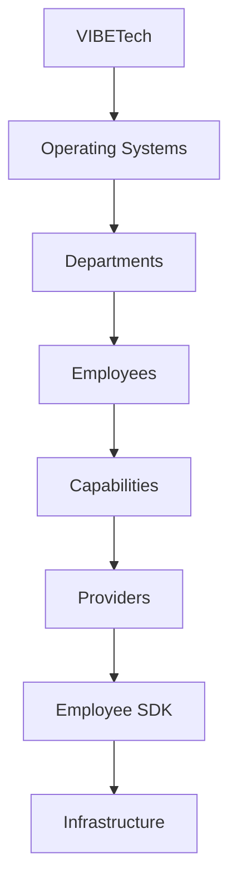

# VIBETech Core Architecture Bible

> Version: Phase 1 (Step 1.3)  
> Status: Single Source of Truth (SSOT)

This document is the engineering handbook for VIBETech Core. Every future engineering decision must be traceable to the principles, contracts, and boundaries described herein.

It is intentionally written to support a company that will exist for decades: stable contracts now, safe extension points later.

---

## CHAPTER 1 — Vision

### 1.1 What VIBETech is

**VIBETech is an AI Operating System for SMBs.**

An “AI Operating System” means:

1. It provides reusable building blocks (AI Employees) that can be deployed across industries.
2. It centralizes orchestration and platform intelligence.
3. It offers standardized interfaces so teams can add capabilities without rewriting the entire platform.
4. It treats industry tools and integrations as *pluggable interfaces* rather than core logic.

### 1.2 Why “AI Employees”

The platform is built around **reusable AI Employees**:

- Employees are reusable across industries.
- Industry-specific knowledge and workflows live *inside* employees (not inside core).
- The platform core provides lifecycle, contracts, governance, and execution architecture.

### 1.3 CRM is only an interface

CRMs (for example: GHL) are **interfaces**, not brains.

VIBETech owns the intelligence:

- The CRM may store leads, contacts, and activity history.
- The employee defines how to interpret that information to achieve outcomes.
- Providers handle the *how* of integrations; employees define the *what* and *why*.

### 1.4 Platform ownership of intelligence

This architecture ensures intelligence stays consistent and portable:

- Teams can add/modify an employee without changing core engine logic.
- Swapping providers (or adding new ones) should not require rewriting employee logic.
- Multi-tenant governance can evolve without redesigning employee artifacts.

---

## CHAPTER 2 — Core Principles

The following principles govern every implementation choice.

### 2.1 Single Responsibility

Each class/module must have exactly one reason to change.

Examples:

- **Registry** discovers and registers employees.
- **Loader** loads artifacts from the filesystem.
- **Validator** validates contracts and produces errors.
- **Context** shapes standardized runtime context.
- **Runner** orchestrates lifecycle (and returns standardized responses).

No other class should “reach into” those responsibilities.

### 2.2 Composition over duplication

Use composition to build new behavior:

- Compose capabilities and providers via contracts.
- Reuse shared SDK abstractions.
- Avoid copy/pasting logic across industries or employee types.

### 2.3 AI is optional

AI execution is not assumed. AI may be present, but it is not required.

The platform must remain functional as a foundation that:

- loads employees
- validates contracts
- prepares execution contexts
- returns standardized placeholder responses during early phases

### 2.4 Humans approve important actions

The platform is designed for governance:

- Employees request permissions.
- The platform/SDK enforces “allowed vs not allowed” decisions later as features evolve.
- Human approvals for high-impact operations remain a first-class concept.

### 2.5 Business outcomes over technology

Engineering must prioritize measurable outcomes:

- Reduce manual work.
- Improve speed and accuracy of operations.
- Provide consistent quality across industries.

Technology choices must serve outcomes—not the reverse.

### 2.6 Free/open-source preferred when practical

When there is a high-quality open-source option, prefer it.

Prefer stability over novelty.

### 2.7 One roadmap, one architecture, one source of truth

VIBETech will be built as a coherent platform:

- One roadmap
- One architecture
- One source of truth

This document is that source of truth.

---

## CHAPTER 3 — Platform Hierarchy

The platform hierarchy defines how “big systems” relate to “small code units”.



### 3.1 VIBETech

The top-level platform boundary. It provides:

- standardized execution contracts
- lifecycle orchestration conventions
- governance and permissions contracts
- event contract scaffolding

### 3.2 Operating Systems

Operating Systems represent product-grade groupings of capabilities.

Example (conceptual): “Sales OS”, “Support OS”.

They should remain platform-level constructs, not one-off solutions.

### 3.3 Departments

Departments are business domains that group employees.

### 3.4 Employees

Employees are the primary unit of reusable AI behavior.

Employees live as artifacts under the top-level `employees/` directory.

Employees are responsible for:

- declaring their contract (`employee.json`)
- providing prompt material (`prompt.md`)
- providing behavioral constraints (`rules.json`)
- optionally declaring permissions and events (docs-only now, enforced later)

### 3.5 Capabilities

Capabilities describe **WHAT** an employee can do.

Capabilities are declared by the employee. Providers do not interpret them as business logic.

### 3.6 Providers

Providers describe **HOW** it is done.

Providers are integration adapters (CRM, LLM, DB, email, etc.).

Providers should:

- expose interfaces and capability execution plumbing
- remain stateless or minimally stateful
- avoid business rules and domain-specific decision-making

### 3.7 SDK

The SDK is the core runtime architecture:

- discovers employees
- loads artifacts
- validates contract schema
- initializes execution context
- orchestrates placeholder execution during Phase 1
- returns standardized responses

### 3.8 Infrastructure

Infrastructure includes:

- databases
- networking / deployment
- job execution systems
- observability systems

Infrastructure must not contain business rules.

---

## CHAPTER 4 — Employee SDK

The Employee SDK is the platform’s internal runtime foundation.

It manages:

1. discovery
2. loading
3. validation
4. execution lifecycle orchestration (Phase 1 returns placeholder outputs)
5. standardized responses

### 4.1 SDK classes (Phase 1)

Below is the SDK flow and responsibilities.


#### Registry

`EmployeeRegistry`

Responsibilities:

- discover employees
- register in memory
- return employees by ID
- list available employees

Non-goals:

- no business logic
- no execution
- no provider calls

#### Loader

`EmployeeLoader`

Responsibilities:

- load a single employee folder
- read:
  - `employee.json`
  - `prompt.md`
  - `rules.json`
- return a complete Employee object shape (contract-level object)

Non-goals:

- no validation beyond filesystem parsing
- no AI / provider execution

#### Validator

`EmployeeValidator`

Responsibilities:

- validate structural requirements:
  - `employee.json` exists
  - `prompt.md` exists
  - `rules.json` exists
- validate required manifest fields:
  - version compatibility metadata
  - capabilities schema
- produce descriptive errors with stable codes

#### Context

`EmployeeContext`

Responsibilities:

- create a standardized execution context object
- populate placeholder containers for:
  - `providers`
  - `config`
  - `logger`
  - `database`
  - `organization`
  - `project`
  - `user`
  - `executionId`

No implementation in Phase 1: context is contract + placeholders.

#### Runner

`EmployeeRunner`

Responsibilities:

- orchestrate lifecycle
  - `initialize() -> execute() -> cleanup()`
  - (Phase 1 returns placeholder outputs)
- validate the employee before running
- return a standardized response object

Hard constraints in Phase 1:

- DO NOT call AI
- DO NOT call providers
- DO NOT execute prompts

---

## CHAPTER 5 — Employee Contract

Employees are contractual artifacts stored in their own directories.

Each employee folder under `employees/` must include:

- `employee.json`
- `prompt.md`
- `rules.json`
- `README.md`
- `tests/`
- `examples/`

### 5.1 `employee.json`

This file is the authoritative manifest contract.

In Phase 1, it must include the metadata fields supported by the SDK schema validation.

Key fields (current + forward-looking contracts):

- `name` (string)
- `industry` (string, metadata only for Phase 1; later business logic must not depend on it)
- `version` (legacy field; used for employee version compatibility in older manifests)
- `sdkVersion` (string, optional)
- `employeeVersion` (string, optional)
- `description` (string)
- `requiresApproval` (boolean)
- `capabilities` (array of strings)
- `permissions` (array of strings, docs-only now)
- `events` (object, docs-only now)

#### Permissions (docs-only contract)

Employees may declare:

```json
"permissions": [
  "contacts.read",
  "contacts.write",
  "email.send"
]
```

Interpretation:

- the employee requests permissions
- later the platform determines whether requests are allowed
- future governance supports multi-organization and role-based authorization

#### Events (docs-only contract)

Employees may declare:

```json
"events": {
  "triggers": ["legal.intake.created"],
  "produces": ["legal.summary.created"]
}
```

Interpretation:

- employee may trigger behavior when events occur
- employee may produce events after completing execution
- future event bus can route triggers to matching employees

### 5.2 `prompt.md`

Prompt content and/or prompt scaffolding for the employee.

In Phase 1:

- the SDK loads it
- the runner does not execute it

### 5.3 `rules.json`

Behavioral constraints for the employee.

In Phase 1:

- loaded and returned as data
- not interpreted as executable business logic yet

### 5.4 `README.md` (employee-level)

Documentation for humans:

- what the employee is
- what artifacts exist
- what lifecycle expectations exist

### 5.5 `tests/` and `examples/`

Both exist to support:

- later unit tests for employee-level contract expectations
- payload examples for debugging and regression testing

These directories keep employee content self-contained and maintainable.

---

## CHAPTER 6 — Capabilities

### 6.1 What capabilities are

**Capabilities describe WHAT an employee can do.**

Capabilities are:

- declared in `employee.json`
- used by the platform/runner to determine which providers and workflows are relevant later

Capabilities are not business logic.

Capabilities should be phrased as capability identifiers or action contracts.

### 6.2 Examples

Examples of capability identifiers (illustrative):

- `client.update.draft`
- `lead.followup.compose`
- `invoice.validate`
- `email.send.template`

### 6.3 Why the separation matters

This separation makes the platform portable:

- employees remain stable even when providers change
- providers become swappable by capability execution mapping

---

## CHAPTER 7 — Providers

### 7.1 What providers are

**Providers describe HOW it is done.**

Providers are integration and execution adapters.

Providers may exist for:

- CRM (e.g., GHL)
- LLM (e.g., OpenAI)
- Database (e.g., SQLite now, PostgreSQL later)
- Email delivery
- Future provider categories

### 7.2 Provider abstraction

The SDK and core runtime interact with providers through a contract boundary:

- Employees never call providers directly.
- Employees declare capabilities.
- Providers execute capability operations.
- Providers remain free of business rules; business decisions remain inside employees.

### 7.3 Provider examples (future)

The architecture anticipates the following provider interfaces:

- `GHL Provider`
- `OpenAI Provider`
- `SQLite Provider`
- `Email Provider`
- `Future providers`

This document does not define their internal behavior beyond the constraints above.

---

## CHAPTER 8 — Permissions

Permissions are a governance contract for Phase 1 + future multi-tenant enforcement.

### 8.1 Permission request flow (future)

1. Employee declares required permissions in `employee.json`.
2. SDK/platform checks the current organization/user role entitlements.
3. SDK decides whether permission is granted.
4. Execution proceeds with allowed provider actions.
5. If denied:
   - the run is blocked
   - response includes error/warnings (standard response contract)

### 8.2 Role-based access (future)

Future enforcement supports:

- multiple organizations
- user roles
- enterprise clients

The permissions contract is the backbone for safe expansion.

---

## CHAPTER 9 — Events

Events enable event-driven orchestration between employees.

### 9.1 Event model

From employee manifest:

- `triggers`: which events cause execution (when wired later)
- `produces`: which events the employee emits after completion

### 9.2 Future event bus (conceptual)

An event bus later will:

- subscribe employees based on `events.triggers`
- publish events after employee completion based on `events.produces`

### 9.3 Why this matters

Event-driven orchestration is a path to:

- automatic chaining of outcomes
- scalable workflows across departments
- reduced coupling between employees

---

## CHAPTER 10 — Folder Standards

This section defines major folder ownership and their allowed responsibilities.

### 10.1 Root folders (high level)

- `backend/`: core server foundation + architecture-neutral runtime SDK + contract code
- `frontend/`: UI workspace (not covered in Phase 1)
- `employees/`: employee artifacts and industry-specific content boundaries
- `docs/`: product + engineering documentation
- `integrations/`: integration adapters (future)
- `prompts/`: prompt assets (platform-level, not employee prompt overrides)
- `scripts/`: automation scripts
- `shared/`: shared utilities (cross-cutting)
- `examples/`: reference projects and payload examples
- `tests/`: platform tests

### 10.2 Backend major directories (responsibility)

Within `backend/`:

- `config/`: configuration contracts and environment mapping
- `controllers/`: request/response boundary later (not part of Phase 1 responsibilities)
- `core/`: architecture-neutral core runtime + SDK + contract enforcement
- `database/`: persistence abstraction boundaries
- `middleware/`: middleware boundaries for later HTTP integrations
- `models/`: schema definitions and data shapes later
- `providers/`: integration adapters later
- `routes/`: routing later
- `services/`: service layer later
- `utils/`: reusable helpers (non-business)
- `knowledge/`: curated knowledge assets used by employees at runtime

### 10.3 Strict boundary: Industry code NEVER belongs in backend core

This is non-negotiable:

- Backend core must never embed `legal`, `construction`, `finance`, etc. naming as logic.
- Industry understanding belongs only inside `employees/`.

This keeps core stable, testable, and portable across future markets.

---

## CHAPTER 11 — Coding Standards

These standards govern all new code.

### 11.1 ES Modules

- Use ES Modules consistently (`import/export`).

### 11.2 Small classes, single responsibility

Prefer narrow responsibilities:

- Validator validates
- Loader loads
- Registry discovers
- Runner orchestrates lifecycle and response formatting

### 11.3 Dependency injection

Use injection to avoid hidden dependencies:

- Provide dependencies via constructor parameters where appropriate
- Avoid global singletons in core contracts

### 11.4 No duplicated logic

Deduplicate:

- shared logic belongs in `backend/core/` utilities where appropriate
- employee-specific logic belongs in the employee folder

### 11.5 Industry code rule

Industry code never belongs in backend core.

If a module imports or branches on industry names, it violates this standard.

---

## CHAPTER 12 — Documentation Standards

Every feature must include:

- Code
- Documentation
- Reusable asset

Documentation means:

- contracts are explicit
- lifecycle expectations are documented
- example payloads are provided where relevant

---

## CHAPTER 13 — Testing Standards

Testing tiers:

### 13.1 Unit tests

- test validator contract and error codes
- test loader parsing and reading behavior
- test standardized response shapes

### 13.2 Integration tests

- test registry discovery against sample employee folders
- test loader output compatibility across manifest versions

### 13.3 Example payloads

Employees should include:

- `examples/` for payload shapes
- reference payloads for debugging

### 13.4 Regression testing

Future SDK changes must:

- remain backward compatible where possible
- update version compatibility policy explicitly

---

## CHAPTER 14 — Deployment Philosophy

### 14.1 Local development

Support local workflow first:

- deterministic environment templates (`.env.example`)
- minimal assumptions about infrastructure

### 14.2 Self-hosted first, cloud later

Design the system so it can run self-hosted:

- stable configuration
- predictable filesystem layout for employee artifacts
- clear boundaries for integrations and providers

Cloud support can build on those primitives.

### 14.3 Open source preferred

Prefer open-source solutions for infrastructure and tooling when practical.

---

## CHAPTER 15 — Engineering Rules

These are binding constraints.

### 15.1 Employees never call providers directly

Employees define capabilities and business outcomes.

They do not invoke provider adapters themselves.

### 15.2 Employees never know about GHL

CRMs are interface adapters handled by providers.

Employees remain portable across CRMs.

### 15.3 Providers never contain business rules

Providers execute capability operations, but they must not:

- decide business outcomes
- embed employee reasoning logic
- encode industry-specific workflows

### 15.4 Infrastructure never contains business rules

Infrastructure manages runtime concerns:

- compute
- network
- deployment
- persistence mechanics

It must not contain domain decision logic.

### 15.5 Business rules belong inside Employees

Business logic and decision policies belong:

- inside the employee artifacts and their contracts
- in later phases, likely as validated rules and structured constraints

---

## CHAPTER 16 — Roadmap Philosophy

### 16.1 One roadmap, sequential development

Avoid parallel reinvention.

Each roadmap step ends with:

1. Architecture review
2. Cursor implementation
3. Manual review
4. Lock

This document is updated through that process and becomes SSOT.

### 16.2 No rabbit holes

Only build what is required for the step.

Prefer stable contracts over speculative features.

---

## CHAPTER 17 — Future Vision

### 17.1 Marketplace

An employee marketplace can distribute reusable employees to industries.

The contracts and lifecycle described in this document enable marketplace compatibility:

- stable discovery/loading/validation
- stable runner response contracts
- consistent execution context and governance model

### 17.2 Business Operating Systems

Multiple operating systems may be created, each composing employees and capabilities.

### 17.3 Departments and employee library

As employee catalog grows:

- departments organize employees
- a library standardizes how employees behave

### 17.4 Enterprise support

Enterprise needs become easier because:

- permissions contract exists
- multi-tenant governance can be layered
- events enable scalable workflows
- providers remain swappable
- platform owns intelligence

### 17.5 Multiple AI providers

The provider abstraction supports multiple LLM backends without changing employee artifacts.

---

## Engineering Oath

Every future contributor must follow this oath:

1. Respect contracts. Do not invent new shapes without updating the Architecture Bible.
2. Keep core industry-agnostic. If industry logic appears in core, remove it.
3. Employees define business rules; providers execute integration mechanics.
4. Return standardized outcomes from the SDK with predictable structure.
5. Document changes so this remains the single source of truth.
6. Build for decades: maintainability, compatibility, and safe extension over short-term hacks.

Contributors who follow this oath protect VIBETech’s ability to scale across industries and time.

