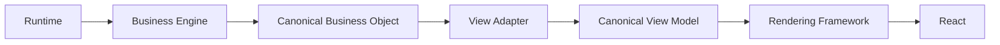

# VIBETech Architecture Bible

This document is an engineering specification for how the VIBETech platform works.
It is the canonical reference for determinism, ownership, event philosophy, and integration rules.

## Table of Contents

1. Vision
2. Platform Philosophy
3. Core Principles
4. Operating Systems
5. Runtime Architecture
6. Canonical Business Objects
7. Business Intelligence Layer
8. View Layer
9. Rendering Layer
10. Navigation Architecture
11. Business Events
12. Platform Pipeline
13. Operating System Communication
14. Future Operating Systems
15. Platform Rules

---

## 1. Vision

VIBETech provides an AI-grade operating system for SMBs, built on reusable **Digital Employees**.
The product goal is consistent operations: repeatable, governed, and measurable workflows—without enterprise complexity.

Determinism is the foundational constraint: the same inputs must yield the same outputs.

---

## 2. Platform Philosophy

The platform is a stack of responsibilities with strict separation:

Runtime → Business Engine → Canonical Business Object → View Adapter → Canonical View Model → Rendering Framework → React

No step is allowed to violate the boundaries:
- Runtimes own state.
- Engines compute canonical outputs.
- View adapters translate only.
- Rendering frameworks present only.
- React holds presentation only.

---

## 3. Core Principles

1. **Single source of truth (SSOT):** every business state exists exactly once and has exactly one owner.
2. **Determinism by default:** canonical outputs are stable and testable.
3. **Immutability by default:** canonical objects are deeply immutable.
4. **Single responsibility per module:** each engine answers exactly one business question.
5. **React is presentation only:** React must not contain business logic or decide platform structure.

---

## 4. Operating Systems

Inside VIBETech, an **Operating System** is a composable capability layer:
- It owns runtime state (or a runtime “sub-state”)
- It exposes deterministic behavior via engines and event application
- It produces canonical business objects that downstream layers consume

### Implemented Operating Systems (aligned with what exists in this repo)

1. **Knowledge OS (implemented as Knowledge Repository + knowledge engines)**
2. **Work OS (implemented as Work Runtime + work event engine)**
3. **Team OS (implemented as Team Runtime + team event engine)**
4. **Mission Control OS**
5. **Navigation (platform service)**

### Future Operating Systems (planned, not implemented as stateful engines yet)
Customer Intake OS, Communications OS, Automation OS, Approval OS, Compliance OS, Finance OS, Scheduling OS, Learning OS, Asset OS

---

## 5. Runtime Architecture

Runtimes are in-memory, immutable-by-construction state stores.
Runtimes do not “compute intelligence”; engines do.

### Company Runtime

**Implemented runtime:** `CompanyWorkspaceRuntime`

Responsibility:
- Owns company identity, business/profile state, and knowledge repository state
- Exposes deterministic getters:
  - `getCompanyProfile()`, `getBusinessProfile()`, `getWorkQueue()`, `getActivities()`, etc.
- Owns the derived “workspace SSOT” signals consumed by view adapters and business intelligence engines.

Ownership summary:
- Company Runtime owns *company and workspace signals*.
- It also owns the knowledge repository state backing Knowledge OS.

### Knowledge Runtime

**Implemented knowledge ownership:** Knowledge is represented as:
- `KnowledgeRepository` state
- knowledge ingestion/publishing/draft engines

In this repo, Knowledge Runtime is not a standalone runtime class; it is **owned by** `CompanyWorkspaceRuntime` (via embedded knowledge repository + derived knowledge getters).

Responsibility:
- Knowledge categories + knowledge items repository
- Knowledge publishing and versioning (via deterministic engines)

### Team Runtime

**Implemented runtime:** `TeamRuntime`

Responsibility:
- Owns deterministic immutable state:
  - team members, departments, roles
  - aggregate metrics
- Mutates only via team events applied through `TeamEventEngine`.

### Work Runtime

**Implemented runtime:** `WorkRuntime`

Responsibility:
- Owns deterministic immutable state:
  - work items, stages, queues, assignments, and basic derived metrics
- Mutates only via work events applied through `WorkEventEngine`.

---

## 6. Canonical Business Objects

Canonical business objects answer business questions and are immutable.
They are never UI contracts.

### Canonical Object Rules

- **Purpose is explicit**: every object belongs to one business question.
- **Immutability is deep**: objects are deep-frozen.
- **Ownership is clear**: only the owning engine produces the canonical object.
- **No UI concerns**: no rendering hints beyond business semantics.

### Examples (implemented)

- Company Brief: “What does the business owner need to know, decide, and do right now?”
- Company Health: “How healthy is this business, and why?”
- Company Insights: “What changed?”
- Company Opportunities: “Where can the business improve next?”
- Company Recommendations: “What should the business do next?”
- Mission Control: composes canonical intelligence for the first experience
- TeamViewModel/WorkViewModel/KnowledgeViewModel: actually view models (see View Layer), not business objects—renderers consume them.

---

## 7. Business Intelligence Layer

The BI layer is a set of deterministic engines that:
- consume runtimes and/or canonical objects
- compute canonical immutable outputs
- never mutate state

### Implemented BI engines

1. **Company Brief Engine**
2. **Company Health Engine**
3. **Insight Engine**
4. **Opportunity Engine**
5. **Recommendation Engine**
6. **Mission Control Generator**

### Why intelligence never mutates state

Because intelligence is derived:
- runtimes are the SSOT for state
- engines are pure functions in behavior (deterministic object generation)
- adapters and renderers consume outputs without side effects

---

## 8. View Layer

View adapters translate canonical objects and/or runtime SSOT into canonical view models.
Adapters do not compute business intelligence beyond deterministic enrichment required for presentation.

### Implemented View Adapters

Mission Control:
- `MissionControlViewAdapter` (canonical Mission Control → Mission Control view models)

Workspace (composed view model set):
- `WorkspaceViewAdapter` produces:
  - navigation view models
  - module view models
  - knowledge view models (categories + shell actions)
  - other workspace sub-views

Team Intelligence Adapter:
- `TeamViewAdapter`: TeamRuntime + Company signals → `TeamViewModel`

Work Intelligence Adapter:
- `WorkViewAdapter`: WorkRuntime + TeamRuntime + Company signals → `WorkViewModel`

Knowledge view (adapter responsibility)
- Knowledge is currently surfaced via `WorkspaceViewAdapter` knowledge view builder.
  - It translates workspace configuration (`knowledgeLayout.categories`) into the canonical knowledge view contract.

### View Adapter responsibilities (non-negotiable)

1. Deterministic translation only.
2. Read-only runtime usage.
3. Deep immutability of the view model output.
4. No UI logic and no platform structure decisions.

---

## 9. Rendering Layer

Rendering frameworks present canonical view models.
They coordinate layout and component composition, but they never compute intelligence.

### Implemented rendering frameworks

Mission Control:
- `MissionControlRenderer` and its section/card/action renderers

Team:
- `TeamRenderer` + `TeamLayout` + sub-renderers

Work:
- `WorkRenderer` + `WorkLayout` + sub-renderers

Knowledge:
- `KnowledgeRenderer` + `KnowledgeLayout` + sub-renderers

### React responsibilities

React does presentation and uses view models as input.
React must never:
- mutate runtime state
- recompute business intelligence
- decide platform architecture or navigation structure

---

## 10. Navigation Architecture

Navigation is a platform capability.
Experiences never decide where they appear: the platform decides.

### Implemented navigation services

- `NavigationService` (backend service)
  - canonical assembly point for `workspaceConfig.navigation`
- `WorkspaceGenerator` delegates navigation assembly to `NavigationService`
- Existing frontend navigation rendering reads navigation view models and uses shell mapping

### Navigation flow (high-level)

```mermaid
flowchart TD
  A[WorkspaceGenerator: enabled modules] --> B[NavigationService.generate()]
  B --> C[workspaceConfig.navigation]
  C --> D[WorkspaceViewAdapter.buildNavigationView()]
  D --> E[Frontend workspaceShellDerivations]
  E --> F[NavigationRenderer (presentation)]
```

### Primary destinations (per taxonomy)

Permanent primary navigation destinations:
- Mission Control
- Team
- Work
- Knowledge
- Company
- Analytics
- Settings

Legacy routes remain functional as compatibility routes and do not become primary destinations.

---

## 11. Business Events

Events are the platform’s mutation protocol.
Only runtimes mutate state—and only via applying validated events.

### Event philosophy

1. Events are immutable records.
2. Event application is deterministic.
3. Engines validate event shape and payload before applying.
4. Applying an event produces a new deep-frozen runtime state.

### Canonical event examples (implemented)

Mission/Company events (examples found in code):
- `COMPANY_EVENT_TYPES.WEBSITE_INQUIRY_RECEIVED`
- `COMPANY_EVENT_TYPES.KNOWLEDGE_CREATED`
- `COMPANY_EVENT_TYPES.KNOWLEDGE_REVISION_CREATED`
- `COMPANY_EVENT_TYPES.KNOWLEDGE_ARCHIVED`

Team events:
- `TEAM_EVENT_TYPES.TEAM_MEMBER_CREATED`
- `TEAM_EVENT_TYPES.TEAM_STATUS_CHANGED`
- `TEAM_EVENT_TYPES.TEAM_WORK_ASSIGNED`
- `TEAM_EVENT_TYPES.TEAM_WORK_COMPLETED`

Work events:
- `WORK_EVENT_TYPES.WORK_ITEM_CREATED`
- `WORK_EVENT_TYPES.WORK_ITEM_STAGE_CHANGED`
- `WORK_EVENT_TYPES.WORK_ITEM_STATUS_CHANGED`
- `WORK_EVENT_TYPES.WORK_ITEM_ASSIGNED`
- `WORK_EVENT_TYPES.WORK_ITEM_BLOCKED`
- `WORK_EVENT_TYPES.WORK_ITEM_UNBLOCKED`
- `WORK_EVENT_TYPES.WORK_ITEM_COMPLETED`
- `WORK_EVENT_TYPES.WORK_QUEUE_CREATED`
- `WORK_EVENT_TYPES.WORK_STAGE_CREATED`

---

## 12. Platform Pipeline

Every major feature follows the mandatory pipeline:



This pipeline is mandatory for:
- Mission Control
- Team
- Work
- Knowledge
- Navigation

---

## 13. Operating System Communication

Operating Systems do not tightly couple.
They communicate through:
- events
- runtimes getters
- canonical business objects
- view adapter translations

```mermaid
flowchart TD
  OS1[Operating System A\n(Runtime + Engines)] -->|events / outputs| OS2[Operating System B]
  OS1 -->|canonical object| BI[Business Intelligence]
  BI -->|canonical object| OS2
```

Rules:
- No direct OS → OS internal state sharing.
- Only runtime getters and canonical outputs are allowed.

---

## 14. Future Operating Systems

Roadmap (planned; not implemented here as new runtimes beyond alignment):
- Customer Intake OS (future)
- Communications OS (future)
- Automation OS (future)
- Approval OS (future)
- Compliance OS (future)
- Finance OS (future)
- Scheduling OS (future)
- Learning OS (future)
- Asset OS (future)

Integration stance for all future OS:
- introduce a runtime and events
- introduce a business engine that answers one question
- introduce a canonical business object
- translate via view adapter
- render via rendering framework

---

## 15. Platform Rules

Non-negotiable rules (engineered into the repo and aligned with PLATFORM_CONSTITUTION):

1. **Business state exists exactly once.**
2. **Every object has exactly one owner.**
3. **Every engine answers exactly one business question.**
4. **React never owns business logic.**
5. **Generate instead of configure.**
6. **Model business concepts, not vendors.**
7. **Every core model must pass the multi-industry test.**
8. **Backend decides structure; frontend renders.**
9. **Deterministic by default.**
10. **Every engine produces a canonical business object, not UI.**
11. **Mission Control composes; it never computes.**
12. **Rule of Compounding:** every new feature should improve the value of existing features.

Additional navigation-specific non-negotiables:
13. **Navigation is owned by NavigationService.**
14. **WorkspaceGenerator delegates navigation assembly.**
15. **Experiences never decide primary navigation placement.**
16. **Legacy routes remain compatibility routes only.**

---

## Diagrams Summary

Included Mermaid diagrams:
- Platform architecture pipeline (Runtime → Engine → Canonical Object → Adapter → View Model → Rendering → React)
- Navigation flow
- Operating system communication

---

## Engineering Notes (Implementation Alignment)

This bible intentionally describes only systems implemented in this repository and their current integration shape.
Future OS systems are marked as future and must follow the mandatory pipeline rules.

