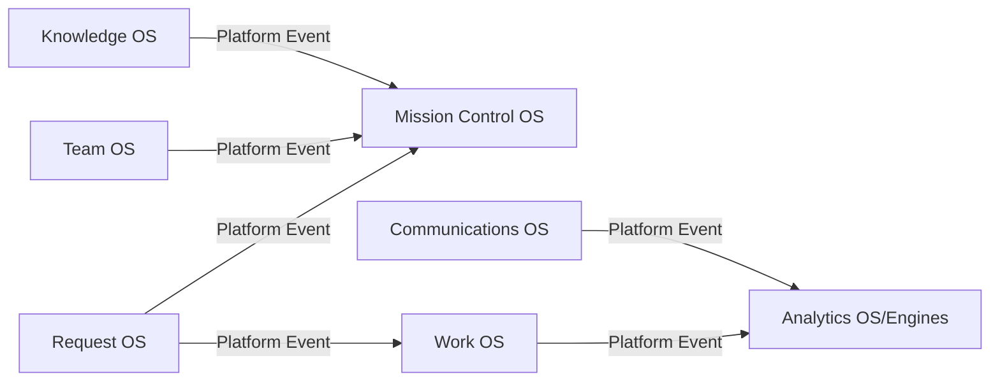

# Platform Event Catalog (Epic 10 Sprint 1)

## 1. Purpose
Define the permanent **Platform Event Architecture** contract that every Operating System (OS) must follow to communicate.

This document is the canonical contract between OS modules. It exists so Operating Systems can remain independent and evolve without direct dependencies.

**Scope note**
- **Current platform:** this sprint is documentation-only. No new runtime behavior is introduced.
- **Future platform:** a `Platform Event Runtime` and `Platform Event Bus (future)` are described as future capabilities.

## 2. Platform Event Philosophy
Platform Events are immutable records used for cross-OS communication.

### Why events reduce coupling
1. **OS independence:** Operating Systems never call each other directly. They publish events and subscribe to events they care about.
2. **Composable workflows:** business workflows become sequences of event reactions rather than tightly-coupled call graphs.
3. **Isolation of changes:** a single OS can evolve its internal logic as long as it continues publishing compatible event contracts.

### Non-negotiables
1. Operating Systems communicate through Platform Events only.
2. No OS directly depends on another OS’s internal state or methods.
3. Event payloads are canonical business facts (not UI state).
4. Events are immutable and deterministic by contract.

## 3. Event Lifecycle
The lifecycle below defines responsibilities and integration points.

```mermaid
flowchart TD
  P[Publisher OS] --> E[Platform Event (immutable record)]
  E --> R[Platform Event Runtime (responsibility: validation + routing)]
  R --> B[Platform Event Bus (future: fan-out + delivery guarantees)]
  B --> S[Subscribers OS / Engines]
```

### Lifecycle components
- **Publisher**: the OS that owns the relevant aggregate state change.
- **Platform Event**: immutable record (the contract).
- **Platform Event Runtime** *(future)*:
  - validates event shape against payload contracts
  - routes events to subscribers
  - enforces idempotency and ordering rules
- **Platform Event Bus (future)** *(future)*:
  - decoupled delivery mechanism
  - persistence/replay (future)
- **Subscribers**: OS components and business engines that react to events.

## 4. Event Structure
Every Platform Event contains the following fields:

| Field | Type | Notes |
|---|---|---|
| `eventId` | string | Globally unique identifier for idempotency. |
| `eventType` | string | Upper snake case, event contract name. |
| `version` | number | Event schema version for `eventType`. |
| `occurredAt` | string (ISO 8601) | Timestamp when the fact occurred. |
| `publisher` | string | OS name that published the event (e.g., `RequestOS`). |
| `aggregateType` | string | Logical aggregate category (e.g., `Request`, `Work`, `TeamMember`, `KnowledgeItem`, `Communication`). |
| `aggregateId` | string | The aggregate identifier affected. |
| `correlationId` | string | Groups related events across a workflow. |
| `causationId` | string | Points to the event that caused this event (if applicable). |
| `payload` | object | Event-specific payload contract (documented below). |
| `metadata` | object | Optional non-contract metadata (tracing, internal hints, etc.). |

### Immutability requirement
Both `payload` and `metadata` are treated as immutable objects by contract. Events are records, not mutable commands.

## 5. Event Naming Rules
Event types use **UPPER_SNAKE_CASE** and represent facts.

### Examples
- REQUEST_RECEIVED
- REQUEST_UPDATED
- REQUEST_QUALIFIED
- REQUEST_REJECTED
- REQUEST_CONVERTED
- REQUEST_CLOSED
- WORK_CREATED
- WORK_UPDATED
- WORK_ASSIGNED
- WORK_COMPLETED
- TEAM_MEMBER_ADDED
- TEAM_MEMBER_UPDATED
- TEAM_MEMBER_ARCHIVED
- KNOWLEDGE_PUBLISHED
- KNOWLEDGE_UPDATED
- COMMUNICATION_SENT
- COMMUNICATION_FAILED
- AUTOMATION_STARTED
- AUTOMATION_COMPLETED
- MISSION_CONTROL_REFRESH_REQUESTED
- etc.

### Additional rules
1. Prefer domain facts over technical steps.
2. Use pluralization consistently where applicable (e.g., `TEAM_MEMBER_*` for single-member aggregates).
3. Do not encode UI semantics into event names.

## 6. Publisher Matrix
For every event define the OS that is the **source of truth** for the aggregate update.

The publisher matrix below describes intended responsibility for the **platform**.

### Current platform OS responsibility (source-of-truth)
| Event Type | Publisher Operating System |
|---|---|
| REQUEST_RECEIVED | **Request OS** |
| REQUEST_UPDATED | **Request OS** |
| REQUEST_QUALIFIED | **Request OS** |
| REQUEST_REJECTED | **Request OS** |
| REQUEST_CONVERTED | **Request OS** |
| REQUEST_CLOSED | **Request OS** |
| WORK_CREATED | **Work OS** |
| WORK_UPDATED | **Work OS** |
| WORK_ASSIGNED | **Work OS** *(or Team/Work integration, but owner remains Work OS by aggregate)* |
| WORK_COMPLETED | **Work OS** |
| TEAM_MEMBER_ADDED | **Team OS** |
| TEAM_MEMBER_UPDATED | **Team OS** |
| TEAM_MEMBER_ARCHIVED | **Team OS** |
| KNOWLEDGE_PUBLISHED | **Knowledge OS** *(owned by Company Workspace Runtime in current repo)* |
| KNOWLEDGE_UPDATED | **Knowledge OS** |
| COMMUNICATION_SENT | **Communications OS** *(or Company workspace communications responsibility)* |
| COMMUNICATION_FAILED | **Communications OS** |

### Future platform OS responsibility
| Event Type | Publisher Operating System |
|---|---|
| AUTOMATION_STARTED | **Automation OS (future)** |
| AUTOMATION_COMPLETED | **Automation OS (future)** |
| MISSION_CONTROL_REFRESH_REQUESTED | **Mission Control OS** *(fact-oriented trigger for refresh composition)* |
| COMPLIANCE_* | **Compliance OS (future)** |
| FINANCE_* | **Finance OS (future)** |

> Note: This sprint describes the permanent architecture. It does not require the current repository to implement the bus/runtime yet.

## 7. Subscriber Matrix
The subscriber matrix defines intended subscribers for each event type.
Subscribers may react with business engines that compute canonical outputs (derived view models, intelligence, etc.).

### Intended subscribers (examples)
| Event Type | Request OS | Work OS | Team OS | Mission Control | Analytics | Communications | Automation | Compliance | Finance |
|---|---|---|---|---|---|---|---|---|---|
| REQUEST_RECEIVED | — | — | — | Possible | Yes | Optional | Optional | Optional | Optional |
| REQUEST_UPDATED | — | — | — | Possible | Yes | Optional | Optional | Optional | Optional |
| REQUEST_QUALIFIED | — | Possible | Possible | Yes | Yes | Optional | Optional | Optional | Optional |
| REQUEST_CONVERTED | — | Yes | Possible | Yes | Yes | Optional | Optional | Optional | Optional |
| REQUEST_CLOSED | — | Possible | Possible | Possible | Yes | Optional | Optional | Optional | Optional |
| WORK_CREATED | Possible | — | Possible | Possible | Yes | Optional | Optional | Optional | Optional |
| WORK_ASSIGNED | — | — | Possible | Possible | Yes | Optional | Optional | Optional | Optional |
| WORK_COMPLETED | — | — | Possible | Possible | Yes | Optional | Optional | Optional | Optional |
| TEAM_MEMBER_ADDED | Possible | — | — | Possible | Yes | Optional | Optional | Optional | Optional |
| KNOWLEDGE_PUBLISHED | Possible | — | — | Possible | Yes | Optional | Optional | Optional | Optional |
| COMMUNICATION_SENT | — | — | — | Possible | Yes | — | Optional | Optional | Optional |
| COMMUNICATION_FAILED | — | — | — | Possible | Yes | — | Optional | Optional | Optional |

### Subscriber philosophy
1. Subscribers should be tolerant to out-of-order delivery **within** an aggregate, depending on ordering guarantees (see Reliability Rules).
2. Subscribers should treat payload as canonical facts.
3. Subscribers do not mutate publisher state directly.

## 8. Payload Contracts
Payload contracts document the expected shape of `payload` per `eventType`.

### General payload contract rules
- Payload is a plain object.
- Payload fields are canonical business facts.
- Payload field names use **camelCase**.
- Payload should never contain transient UI state.
- Payload should avoid “partial reconstruction” patterns; prefer explicit fields.

### Request Events

#### REQUEST_RECEIVED (eventType: `REQUEST_RECEIVED`)
Publisher: Request OS
Aggregate: `Request`

`payload` fields:
- `request` (object, required)
  - `id` (string)
  - `title` (string)
  - `description` (string)
  - `requestType` (string)
  - `status` (string) *(publisher sets to `received`)*
  - `priority` (string)
  - `channel` (string)
  - `source` (string)
  - `requester` (string)
  - `receivedAt` (string, ISO 8601)
  - `dueAt` (string ISO 8601 or null)
  - `assignedWorkId` (string or null)
  - `assignedTeamMemberId` (string or null)
  - `qualificationStatus` (string or null)
  - `attachments` (array)
  - `metadata` (object)

#### REQUEST_UPDATED (eventType: `REQUEST_UPDATED`)
Publisher: Request OS
Aggregate: `Request`

`payload` fields:
- `requestId` (string)
- `patch` (object, required)
  - Patch represents field updates. Keys must be explicitly allowed by the publisher’s contract.
  - Must not include:
    - `id`
    - `receivedAt`
    - `status` *(status changes are expressed via lifecycle events below)*

#### REQUEST_QUALIFIED
`payload` fields:
- `requestId` (string)
- `qualificationStatus` (string or null)

#### REQUEST_REJECTED
`payload` fields:
- `requestId` (string)
- `qualificationStatus` (string or null) *(reason/status label; no external assumptions)*

#### REQUEST_CONVERTED
`payload` fields:
- `requestId` (string)
- `assignedWorkId` (string or null)
- `assignedTeamMemberId` (string or null)
- `qualificationStatus` (string or null)

#### REQUEST_CLOSED
`payload` fields:
- `requestId` (string)

### Work Events

#### WORK_CREATED
`payload` fields:
- `work` (object, required) *(canonical work object snapshot)*

#### WORK_UPDATED
`payload` fields:
- `workId` (string)
- `patch` (object, required)

#### WORK_ASSIGNED
`payload` fields:
- `workId` (string)
- `assignment` (object, required)
  - `id` (string)
  - `assigneeId` (string)
  - `assigneeType` (string)
  - `status` (string)
  - `assignedAt` (string ISO 8601)

#### WORK_COMPLETED
`payload` fields:
- `workId` (string)
- `completedAt` (string ISO 8601 or null)

### Team Events

#### TEAM_MEMBER_ADDED
`payload` fields:
- `member` (object, required) *(canonical team member object snapshot)*

#### TEAM_MEMBER_UPDATED
`payload` fields:
- `memberId` (string)
- `patch` (object, required)

#### TEAM_MEMBER_ARCHIVED
`payload` fields:
- `memberId` (string)
- `archivedAt` (string ISO 8601 or null)

### Knowledge Events

#### KNOWLEDGE_PUBLISHED
`payload` fields:
- `knowledgeId` (string)
- `version` (number or string)
- `publishedAt` (string ISO 8601)

#### KNOWLEDGE_UPDATED
`payload` fields:
- `knowledgeId` (string)
- `patch` (object, required)

### Communications Events

#### COMMUNICATION_SENT
`payload` fields:
- `communicationId` (string)
- `sentAt` (string ISO 8601)
- `channel` (string)
- `recipient` (string)

#### COMMUNICATION_FAILED
`payload` fields:
- `communicationId` (string)
- `failedAt` (string ISO 8601)
- `reason` (string)

### Automation/Mission Control Trigger Events (future)
For future OSes, payload contracts follow the same principles:
- include canonical identifiers
- include minimal business facts
- no UI semantics

## 9. Versioning Strategy
### Event schema versioning
1. `version` indicates the schema version of `payload` for a given `eventType`.
2. Backward compatibility is required:
   - additive fields should be safe for subscribers
   - breaking changes must increment `version`
3. Subscribers declare which versions they support.

### Upgrade strategy (future)
- Dual-publish during transitions (future platform feature).
- Use idempotency (`eventId`) to safely handle duplicate deliveries.

## 10. Reliability Rules
These rules are intended for the **Platform Event Runtime** and **Platform Event Bus (future)**.

### Ordering
- **Ordering guarantee (intended):** events are delivered in causal/aggregate order per `aggregateType + aggregateId`.
- **Cross-aggregate ordering:** not guaranteed unless correlation/causation dependencies exist.

### Idempotency
- Subscribers must treat `eventId` as the deduplication key.
- Re-delivery of the same event must not produce divergent state.

### Immutability
- Event records are immutable after publication.
- Subscribers must not modify `payload` or `metadata`.

### Replayability (future)
- Replay is planned once the bus/runtime supports persistence.
- Replaying the same event stream should deterministically reproduce derived outputs.

## 11. Platform Principles
1. **No OS direct calls:** Operating Systems never depend on each other’s in-process APIs.
2. **Canonical facts only:** Events carry business facts, not view state.
3. **Deterministic enrichment:** subscribers compute derived outputs deterministically.
4. **Ownership is single-source-of-truth:** each aggregate is owned by exactly one OS.

## 12. Future Roadmap
This section describes future capabilities without specifying implementation details.

### Platform Event Runtime (future)
- Payload validation against contracts
- Routing to subscribers
- Idempotency and deduplication
- Aggregate-level ordering enforcement

### Platform Event Bus (future)
- Persistent event storage for replay
- Fan-out delivery mechanism
- Distributed execution support
- Subscription management

### Persistence + replay (future)
- Replay by `aggregateType + aggregateId`
- Replay by `correlationId`
- Deterministic rebuild of derived read models

## Diagrams

### Event lifecycle (publisher → runtime → future bus → subscribers)
```mermaid
flowchart TD
  P[Publisher OS] --> E[Platform Event]
  E --> R[Platform Event Runtime]
  R --> B[Event Bus (future)]
  B --> S1[Subscriber OS/Engine]
  B --> S2[Subscriber OS/Engine]
```

### Operating System communication (no direct OS calls)


### Publisher/subscriber relationships
```mermaid
graph TD
  subgraph Publisher
    RQ[Request OS]
    WK[Work OS]
    TM[Team OS]
    KB[Knowledge OS]
    CO[Communications OS]
  end

  subgraph Subscribers
    MC[Mission Control]
    AN[Analytics]
    AU[Automation (future)]
    CM[Compliance (future)]
    FI[Finance (future)]
  end

  RQ --> MC
  RQ --> AN
  RQ --> AU
  WK --> AN
  WK --> MC
  TM --> MC
  TM --> AN
  KB --> MC
  CO --> AN
  AU --> MC
  CM --> MC
  FI --> MC
```

